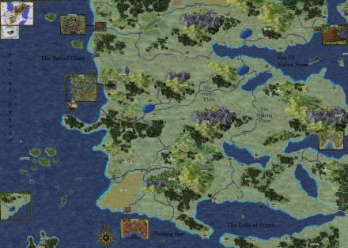
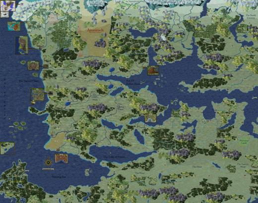

<h1></a>BP-BGT Worldmap</h1>

<h3>A Spellhold Studios mod for Baldur's Gate 2: SoA/ToB<h3>

 

**Authors:** Yacomo, King Diamond, Erebusant, Weigo  
**Mod Website and Forum:** <a href="http://www.shsforums.net/index.php?showforum=401">Spellhold Studios</a>  

## 

[Read the mod's readme](https://spellholdstudios.github.io/readmes/worldmap-readme-english.html)

[Download the mod at Spellhold Studios](http://www.shsforums.net/files/file/308-bp-bgt-worldmap/) 

## 

<a href="#intro">Overview</a> &#x2B25; <a href="#compat">Compatibility</a> &#x2B25; <a href="#installation">Installation</a> &#x2B25; <a href="#components">Components</a> &#x2B25; <a href="#faq">FAQ</a> &#x2B25; <a href="#credits">Credits</a> &#x2B25; <a href="#versions">Versions History</a> 

## Overview

This mod replaces the in-game worldmap with a large, new worldmap. It is used especially for the Megamodification (BGT, TDD, SOS, CtB, TS, DSotSC, NTotSC, SoBH, Drizzt Saga...) or partial installations of the Megamodification. It also includes a full set of coloured map icons. The mod offers the choice between two different worldmap sizes: large and huge. Either of these two worldmaps can be used for BG1, BG2 and ToB. Alternatively, a smaller, specially prepared worldmap can be used for ToB. The mod also offers optional, alternative travel times and area visibility. Lastly, the mod includes a savegame converter, which allows old saved games to be updated to include the new map(s). (The worldmap data is also stored in the savegame files. If you want to install this worldmap, run the savegame converter and you don't have to start a new game.).

This is the original introduction written by Yacomo:

>Please allow me a few words about my motivation in doing this...

>I always loved maps, guess since I first got my hands on the middle earth atlas. I always liked the infinity engine games as well, but those two things had nothing to do with each other...

>Well, nothing to do until I started playing the BP-BGT-NeJ-CtB-DSotSC-BH-NTotSC monster in early 2005. I became a fan of the Check the Bodies worldmap immediately and I fell in love with the spirit of the modding community shortly thereafter. I had to give it back something...

>What I never liked about the BP-BGT map was the mix of coloured and black and white icons. So I was already tinkering with the idea of creating coloured versions of all the Baldur's Gate map icons when Horred the Plague posted <a href="http://forums.spellholdstudios.net/index.php?act=ST&amp;f=193&amp;t=13954">link</a> on the former forgottenwars forums...

>That was the starter I was waiting for! So I picked up the task, made myself comfortable with GIMP (who needs Photoshop - bah :smile: and this is the result - hope ya like it!

At the beginning of the year 2006 Yacomo retired the first time from this mod and King Diamond and Weigo took over the worldmap. King Diamond, one of the WeiDU coding chiefs, made a fantastic new code for the worldmap. Weigo made a lot of small and large changes to the worldmaps.

In the spring of 2007 Erebusant made an extra update for alternative travel times, area visibility and he took over the support in the forum and is still helping to find all bugs and testing new codes.

One and a half year later Yacomo returned and he brought a new larger worldmap. With Weigo's help, the map is now completely labeled with all cities, mountains and regions.

## Compatibility

This mod is designed to work on the following Infinity Engine games: the original Baldur's Gate II (BG2 or just SoA) with or without the Throne of Bhaal (ToB) expansion, Baldur's Gate II: Enhanced Edition (BG2EE), the conversion projects Baldur's Gate Trilogy (BGT) and Enhanced Edition Trilogy (EET).

This is a WeiDU mod, and therefore should be compatible with all WeiDU mods. If you encounter any bugs, please report them on the forum! 

:warning: BP-BGT Worldmap is not compatible with any Baldurdash!!! 

<a href="#top">Back to top</a>

## Installation

#### Notes

<em>If you've previously installed the mod, remove it before extracting the new version. To do this, run **`setup-bp-bgt-worldmap.exe`**, un-install the previously installed main component and delete the :file_folder: bp-bgt_worldmap folder.</em>

<em>When installing or un-installing, **do not close the DOS window** by clicking on the **X** button! Instead, press the **Enter** key whenever instructed to do so.</em>

**Disable any antivirus** or other memory-resident software before installing this or any other mod. Some (particularly avast and Norton!) have a tendency to report false positives with mod activity, resulting in failed installs.

## 

#### Enhanced Editions Note

The Enhanced Editions are actively supported games. Please note that every patch update will wipe your current mod setup! If in the middle of a modded game you might want to delay the patch update (if possible) as even after reinstalling the mods, you might not be able to continue with your old savegames. Alternatively, copy the whole game's folder into a new one that can be modded and will stay untouched by game patches. It is important that you install the mod to the language version you are playing the game in. Otherwise, the dialogues of the mod will not show but give error messages.

## 

#### Windows

Extract the contents of the mod archive into the folder of the game you wish to modify (*the folder which contains the "CHITIN.KEY" file*), using <a href="http://www.7-zip.org/download.html">7zip</a>, <a href="http://www.rarlab.com/download.htm">WinRAR</a>, or another file compression utility that handles .zip files. On successful extraction, there should be a :file_folder: bp-bgt_worldmap folder and a setup-bp-bgt_worldmap.exe file in your game folder. To install, simply double-click **`setup-bp-bgt_worldmap.exe`** and follow the instructions on screen.

At the installer itself is finished, the map graphics will be uncompressed automatically. This last step may take a while depending on your machine. Please do not interrupt it.

Run **`setup-bp-bgt_worldmap.exe`** in your game folder to reinstall, un-install or otherwise change the component settings.

## 

#### Other systems (Linux, 64-bit Mac)

**Note:** BP-BGT Worldmap relies on an external executable called <a href="http://www.shsforums.net/topic/47779-mospack/">mosunpack</a>. Mosunpack comes bundled with the mod (located in bp-bgt_worldmap/bin/) and the mod will attempt to run it inside the mod directory. Should this for any reason not be possible you need to place mosunpack on your system path and allow it to be executed as a program (chmod it) before attempting to install the mod.

Download a compiled version of <a href="https://github.com/WeiDUorg/weidu/releases">WeiDU</a> appropriate for your platform. Place the WeiDU and WeInstall binaries on your path. If you don't already have one it is recommended you create a directory in your home directory, add that directory to your path and place your binaries there. If you are on Linux, or another case-sensitive environment, you also need the tolower binary.

Extract the BP-BGT-Worldmap archive to your game-installation directory. Open a terminal in your installation directory. Run tolower if you need to. Issue the command **`WeInstall bp-bgt-worldmap`** and follow the instructions.

## 

#### Note for Complete Un-installation

In addition to the methods above for removing individual components, you can completely un-install the mod using **`setup-bp-bgt_worldmap --uninstall`** at the command line to remove all components without wading through prompts. 

<a href="#top">Back to top</a>

## Components

The installer includes the following components.  

**1. Worldmap for Baldur's Gate - including colored Baldur's Gate map icons** 

You must choose between:

1. Original travel times and area visibility, or
2. Revised travel times and area visibility.

and:

1. Large worldmap size (4900x3500), or

2. Huge worldmap size (8000x6300).

## 

**2. Worldmap for Throne of Bhaal** 

1. Use new worldmap for Throne of Bhaal, or
2. Use clothmap-style map for Throne of Bhaal.

## 

**3. Savegame converter** 

This component converts old Savegames (No "*New Game*" needed).

:warning: If you un-install the mod and you wish to keep using your existing saved-games, you need to run the savegame converter **after** the un-installation.

<a href="#top">Back to top</a>

**4. Worldmap UI** 

This component adds two worldmap UI designs (Only for EE).
1. BG2EE design
2. Dragonspear UI design

## Frequently Asked Questions

**Q: All or some map icons are on the wrong position?**  
A: Reinstall the complete worldmap.

**Q: I installed the worldmap, but there is no new worldmap in the game**  
A: Either start a new game or use the savegame converter.

<a href="#top">Back to top</a>

## Credits and Acknowledgements

#### Painters: Yacomo, Weigo 
#### Coders: King Diamond, Weigo, Erebusant, Wisp
#### Support: Erebusant

#### Special Acknowledgements to:

- **German translation**: Weigo.
- **Italian translation**: Ilot and Turambar.
- **Polish translation**: Hesus, K4thos and morgan, as well as people from Children of Bhaal Clan and Tawerna Hrothgara Forums.
- **Spanish translation**: Ghildrean.
- **French translation**: Isaya.
- **Russian translation**: prowler and Silent.
- **Others**: Valiant, CBisson, Sir BillyBob, Horred the Plague, HardenCoonor, K4thos, Mad Mate, NIGHTMARE, hlidskialf, Seanas, Ascension, Per Olofsson, The Wizard, K'aeloree, White Agnus, Roberciiik, p_zombie, abalabokhin, Spellholdstudios, G3, Blackwyrm, Kerzenburgforum, Rosenranken, Pocketplane.

## 

#### Copyrights Information

###### BP-BGT worldmap is not developed, supported, or endorsed by BioWare&trade; or Interplay/BlackIsle, Overhaul, Beamdog or the Wizards of the Coast in any way.
###### The Big Picture - Baldur's Gate Trilogy compatibility mod was created by Horred the Plague, Baldur's Gate Trilogy was created by Bardez, The Darkest Day was created by Potencius (Max) and Minto - Tweaked by folks at TeamBG, Shadows over Soubar and Check the Bodies were created by CBisson, Tortured Souls and Neverending Journey were created by Vlad, Secret of Bonehill was created by Sir Billybob, Dark Side of the Sword Coast was created by TeamBG and ported to BP-BGT by Sir Billybob, Northern Tales of the Sword Coast was created by Aurelinus and ported to BP-BGT by Sir Billybob. Large parts of this readme were inspired by the ones made by the gibberlings3 team for their mods.
###### If there are any copyright issues or this statement needs revision then please contact me and advise me what to do about it.
###### This mod was created to be freely enjoyed by all Baldur's Gate 2 players. However, it should not be sold, published, compiled or redistributed in any form without the consent of the author. 

<a href="#top">Back to top</a>

## Versions History

##### Under development version

- Fixed Winding Water river source to start at March of Chelimber on the map image
- Updated Hidden Refuge position
- Updated mods to use dedicated map icons:
	- Innershade
	- The White Queen (Silent Swamps)
	- Fishing for Troubles (Government District West)
- Polish translation update
- Russian translation update

##

##### Version 11.0.0 (27 January 2023)

- New component for worldmap UI
	1. BG2EE design
	2. Dragonspear UI design
- Worldmap UI automatically scale with the scale_ui option
- Added new icons to BPBGTMAP.BAM file
- BPBGTMAP.BAM v1 and v2 has the same number of icons
- EET and BP-BGT-Worldmap has the same icon sequence (Modder's notes)
- Added under bp-bgt-worldmap\docs a small modders tutorial (Modder's Notes)
- Added river to the map image to better fit SoD original map
- Added new areas (Soubar and Lyrar's Hold) for Shadows over Soubar modification
- Added new areas (7 locations from Icewind Dale) for Region of Terror modification
- Updated mods to use dedicated map icons:
	- NTotSC (only Northern Citadel)
	- Southern Edge
	- Tangled Oak
	- Tales of the Deep Garden
	- Alabaster Sands
- Polish translation update
- Russian translation update

##

##### Version 10.2.6 (23 December 2020)

- added new bpbgtmap.BAM for bgt and ee that includes BST Mapicon (on slot 29 resp 28 if counted from 0).
- added "changelog_v10-2-4_and higher.txt" to the main mod folder.

##

##### Version 10.2.5 (11 March 2020)

- Compatibility with 'Sensible Entrance Points' from Tweaks Anthology.

##

##### Version 10.2.4 (7 January 2020)

- corrected area names for DSotSC areas (areas should be named correctly and should all have names on the worldmap).
- corrected area visibility for ntotsc (areas should have the same visibility on worldmap as in original mod).
- added changelog.txt file.
- renamed folder to "bp-bgt-worldmap".
- moved setup-bp-bgt-worldmap.tp2 inside mod folder.
- added bp-bgt-worldmap.ini with mod info meta data.

## 

##### Version 10.2.3 (26 September 2018)

- Update EE map-icon file.

## 

##### Version 10.2.2 (26 November 2017)

- Update compatibility checks for BG2 Tweak Pack to include Tweaks Anthology.

## 

##### Version 10.2.1 (4 January 2016)

- Update Polish translation.

## 

##### Version 10.2 (8 August 2015)
	
- Fix long-standing bug involving area resref and short in the WMAP structure (to enable compatibility with Wheels of Prophecy).
- Fix a bug that allowed travel to SoA areas in the ToB map.
- Try harder to detect and fix incorrectly appended data tables.
- Update the BAM file for EE.
- Remove duplicate links from the BGII: EE map.
- Fix broken entrances among the BG: EE map links.
- Fix inconsistent travel times and area linkage if Fishing For Trouble was installed.
- Add compatibility with BG2 Tweak Pack's Sensible Entrance Points.
- Add compatibility with Wheels of Prophecy.
- Add compatibility with Almateria's Restoration Project.
- Fix XP issue plaguing characters with more than 2950000 XP during SoA.

## 

##### Version 10.1 (25 April 2015)

- Compatibility with BG:EE (thanks, White Agnus).
- Prevent the ToB components from being installable on BG1.
- Compatibility with EET.
- Use HANDLE_CHARSETS.
- Try to detect and fix incorrectly appended data tables.

## 

##### Version 10.0.2 (20 July 2014)

- Correct manifestation (install fails when FFT is installed) of a more general problem exposed in version 10.

## 

##### Version 10.0.1 (14 July 2014)

- Fix regression that added a second Watcher's Keep to the worldmap.

## 

##### Version 10 (13 July 2014)

- Compatibility with BGII:EE.
- Update the Polish translation.
- Fix incorrect map icons for the Oasis and Abazigal's Lair while using either of the large maps for ToB.
- Reposition some ToB map icons for improved spatial coherence.
	- Move Amkethran to the hills on the outskirts of the Calim desert, so it's in reasonable proximity of Abazigal's Lair and Sendai's Enclave and somewhere you could conceivably end up at after leaving the Oasis.
	- Move the Oasis north and east, so it's conceivably on a path between Saradush and Amkethran.
	- Move the North Forest north and east, so it's not an unbelievable detour on the path to the Temple.
	- Swap the locations of Abazigal's Lair and Sendai's Enclave, so their local maps better match the terrain on the worldmap.
- Reposition some SoA map icons under "Original travel times and area visibility" for improved spatial coherence.
	- Move Brynnlaw and the Asylum onto the actual Nelanter isles.
	- Move the Underwater City to a location you could conceivably end up at while sailing back to Athkatla.
	- Move the Druid Grove closer to Trademeet and out of the mountains.
- Add the Drizzt encounter to the link between the Underdark Exit and Watcher's Keep.
- Do not overwrite xnewarea.2da or xl3000.2da.
- Internal changes for cleaner code and better structure.
- Correct "Suldanessalar" spelling error.
- Correct "Amekthran" spelling error.

## 

##### Version 9.0.2 (10 August 2013)

- Fixed two bugs in the savegame converter.
- Added un-installation directions to the readme.
- The mod can now be installed on 64-bit Macs.
- The installation does not fail if worldmap.mos already exists in the override.

## 

##### Version 9.0.1 (19 November 2011)

- Updated the Russian translation.
- Updated to WeiDU 231.

## 

##### Version 9 (30 October 2011)

- Major revisions of the code &ndash; the data-handling code has been completely rewritten.
- Fixed a bug where some areas were not properly assigned a name and tool-tip.
- The link-patch system has been scrapped, as it was being used incorrectly and serves no purpose.
- "Revised" now only adds mod-added areas to the worldmap if the associated mod is actually installed.
- "Revised:" You can only reach the Cloakwood mines from the fourth Cloakwood area. For real, this time.
- "Revised:" The mod will now only ignore some links from "worldmap/map_mods_links.tbl" instead of blanket-excluding whole swaths of links.
- The mod can now be installed on Linux. Compatibility with Mac OS X will be added when I can get my hands on a Mac version of mosunpack.
- The mod now offers the choice between original travel times and area visibility and revised travel times and visibility when installed on Tutu.
- Added a compatibility hack for Fishing for Trouble. Thanks to Mad Mate for providing the data.
- Added compatibility with components 1030, 1035 and 1036 of BG2 Tweaks, the Cloakwood components of BG1 NPC and component 2600 of BGTTweak.
- Fixed the character encoding for the French, German, Italian and Spanish translations. All symbols should now be correctly displayed on Windows and Linux, both during the installation and in-game. Thanks to Turambar for pointing out the issue.
- Updated Russian, French and Italian translations.
- Corrected an error in the German translation.

## 

##### Version 8.01 (12 December 2010)

- Fixed a bug that would cause the installation to fail on inter-mod worldmap links if only one of the mods was installed.

## 

##### Version 8 (4 December 2010)

- Major revisions of the code - the worldmap-patching code has been completely rewritten and the mod has been streamlined in general.
- A bug occasionally causing the "20h travel from the Promenade" problem and other problems has been fixed.
- Revised Travel Times should be less incompatible with other mods (*e.g.* Innershade).
- The Worldmap v7 French patch, Imoen patch and Tutu patch have been included.
- Included Russian translation.
- Fixed a G3Anniversary-related bug.
- The mos files are unpacked and copied into the game in a more robust manner.
- Revised Travel Times: Added missing TDD links.
- Revised Travel Times: Added links between Cloudpeaks (AR4300) and Nashkel (AR3700) and vice versa and removed link from Ankheg Farm (AR8300) to Cloakwood Mines (AR8600). Also made the corresponding changes to the Tutu tables.
- Revised Travel Times: Moved Western Cloudpeaks (AR4200) to [1640.2781] and Cloudpeaks (AR4300) to [1755.2795]. Cloudpeaks is now almost due east of Western Cloudpeaks and southwest of Nashkel. Also made the corresponding changes to the Tutu tables.
- Fixed a bug where the wrong icons would appear on the ToB map if the clothmap-style ToB map was used.
- "Somewhere far North" is now properly localised on the large (small) worldmap during Tutu games.
- Corrected a NTotSC-related typo in the Spanish translation.
- The non-English worldmap images (the .moz files) are now downloaded separately from the main package.
- There are no longer two subcomponents for worldmap for Tutu and worldmap for megamods. The installer detects this on its own.

## 

##### Version 7.1 (28 December 2008)

- Changed area flag for ARD000 from 4 to 6 so travel is enabled by adjacent &amp; dialog instead of just by dialog.
- Added Drizzt Saga translation code to new_tables_BP.tph
- Fixed translation string ordering for “Revised” component BGT translation files.
- Updated several translation files in several languages.

## 

##### Version 7.0 (27 July 2008)

- New worldmap size 8000x6300.
- All areas and cities are labeled on the map.
- Spanish translation added.
- Change no. 2.
- Compatible with Tutu and EasyTutu.

## 

##### Version 6.6.1 (23 June 2007)

- Polish translation

## 

##### Version 6.6 (18 June 2007)

- AR5202 - Forest of Mir(The Temple) --> 2500:2650 - current location is moved too far to the south IMO.
- AR5500 - Amkethran --> 2580:2550 - currently located too far to the east.
- AR6100 - Sendai's Lair --> 1960:2570 - currently located in Snowflake Mountains at all - way too far from ToB surrounding.
- AR6300 - The Oasis --> 1720:2750 - for a better layout with new AR6100 location.
- AR1900 - Druid Grove --> 2680:1600.
- AR1700 - Small Teeth pass --> 1800:1655.
- AR2000 - Trademeet --> 2170:1585 2175:1590 - the city and the text banner and the text moved to the right position. So we don't need the label any more.
- AR2000 AR2000 AR2000 4 13 1800 1655 @777014 N N //Trademeet.
- Fixed "No BGT" install, Riatavin Timer &amp; "Greyed" Ar.
- Fixed "new_map_mods_areas_NTotSC.tbl".
- Fixes for the Revised Area Visibility and travel times:
	- new_map_mods_areas_BGT.tbl.
		- a. Western Cloudpeaks x +15 y -10.
		- b. The Cloudpeaks x -20 y -145 Name Label Removed.
	- new_map_mods_areas_CTB.tbl.
		- a. Central Hlondeth x NC y +10 Name Label Re-Added BAM = #21.
		- b. East Hlondeth x -10 y +5 Name Label Re-Added BAM = #20.
		- c. West Hlondeth x -25 y +100 Name Label Re-Added BAM = #24.
		- d. BrimstoneBridge x NC y -50.
	- new_map_mods_areas_ROT.tbl.
		- a. Slave Route x NC y +5.
		- b. NorthCave x +35 y +30.
		- c. Westchar x +150 y -25.
	- new_map_mods_areas_TDD.tbl.
		- a. TrollMountains x +42 y +25 Name Label Removed.
		- b. DeepMirForest x NC y +50.
		- c. Eshpurta x +10 y NC.
	- new_map_mods_links_BGT.tbl.
		- a. Various minor additions and/or deletions to links table.
	- new_map_mods_links_SOBH.tbl.
		- a. Various minor additions and/or deletions to links table.
	- new_tables_BP.tph.
		- a. Forest of Tethyr x NC y +10 Name Label Removed (Label Exists on Map).
		- b. Druid Grove x &amp; y coordinates placed at x = Trademeet +80 &amp; y = Trademeet +50.
- Italian translation.
- Reorganized Setup-BP-BGT-Worldmap.tp2 code.
- You can now choose between Revised and Original travel times and area visibility.
- New Hlondeth map flyout.
- Large worldmap 4900x3500.
- Huge worldmap 8000x4600.
- Converter for savegames.

## 

##### Version 6.5 (6 April 2007)

- Corrected area flags in "Revised Travel Times" component &amp; the Tutu installation for proper visibility of areas via "walking to edge of areas".
- Deleted approximately 75% of links in "Revised Travel Times" component &amp; the Tutu installation because they were unnecessary and caused areas to appear at the wrong time. Kept the links needed for proper visibility of areas via "walking to edge of areas".
- Removed the majority of bafs that were used to extend area scripts for the area visibility issue. Still include revised Bandit Camp visibility, and Cloakwood Lodge is available in Chapter 2 to retrieve Gurke's Cloak, however Cloakwood Nest flag is set to 4 and AR7000 script keeps Cloakwood Nest from being revealed until GT Chapter 4.
- Added code to build the "new_map_mods_areas.tbl" &amp; "new_map_mods_links.tbl" in the lib folder from a start of 0 bytes to repair improper patching of Worldmap/map_mods_areas.tbl and Worldmap/test_table.tbl if any one of BGT, SoS, TDD, CtB, RoT, DSotSC, NTotSC, or SoBH was not installed.
- Added Werewolf Isle, Balduran's Shipwreck from BGT &amp; Sirene's Island from NTotSC to Worldmap locations.(Still need an area Icon of a shipwreck to make this look cool!! :smile:
- Added lib/remove_trigger_macro.tph (Thanks pro5!!!) and added code to .tp2 to remove travel triggers from ARW000 &amp; ARW500 to disable automatic travel from area to area on Werewolf Island.
- Added new search maps for ARW000 &amp; ARW500 to enable WM6 travel on Werewolf Island.
- Added new search map and travel link to reveal AR40PB by travelling north out of AR01PB by the little stream in the NE corner.
- Added new search map and travel link to reveal AR8500 by travelling north out of AR8400 by the little stream in the NE corner.
- Revised lib/new_tables_BP.tph to adjust inline links table to have proper entrance names for AR1700, AR1800, AR2500 &amp; AR2600. (BG2 Fixpack Support).
- Added backup of dialog.tlk and chitin.key to both BP-BGT &amp; Tutu installations.
- Added an installation marker as a check for the Werewolf Island WM6 change.
- Added icewind dale to map.

## 

##### Version 6.4 (04 January 2007)

- Repaired the code for Tutu.
- Corrected the area flags for Tutu.
- New area icon.
- English version: Tethir --> Tethyr.
- New proper area visibility BGT and Tutu.

## 

##### Version 6.3 (28 June 2006)

- Initial release for the new code.

## 

##### Version 5 (04 December 2005)

- Added compatibility patches for upcoming BGT-WeiDU beta 5; these patches were kindly written for me by Ascension64.
- Fixed a crash when moving from AR9500 to AR9600 on all versions of BGT-WeiDU. The offset 0x25BB4 had a reference to AR5700, which was still the classic BG name of that area. It was be changed to AR4800. Thanks to Ascension64 for
pointing this out.

## 

##### Version 4 (04 November 2005)

- German translation added by Weigo.
- Deprecated option to choose between making all map icons visible and making only the default icons visible since it caused more harm than good.
- Upgraded installer to WeiDU 185.
- Removed all named entry points for DSotSC area links between areas DSC001 and DSC002 and replaced them with proper entry location flags, this will hopefully make the map compatible with all DSotSC versions currently around.
- Watcher's keep is now always visible on map.
- Added "can be visited" flag to TDD areas Eshpurta (DD2300), Purskal (DD1900) and Trollford (DD9000).
- Moved AR0602 (starting area of BG2) onto the water so that it no longer overlaps with AR0700 (Waukeen's Promenade), also changed the map icon.
- Added compatibility patch that replaces some random encounter areas (AR3525 and AR3526) that were added to BG2 areas by CtB with stock BG2 random encounter areas if CtB is not installed; otherwise the game could crash if CtB was not present.
- Fixed a typo in a random encounter area reference from AR043 to AR0043.
- Updated readme to properly reflect the translation from forgottenwars to Spellhold Studios.

## 

##### Version 3b (25 June 2005)

- Added compatibility for upcoming BGT-WeiDU 0.99.
- Upgraded installer to WeiDU 184.
- Fixed entry point when travelling from AR7500 (Zombie Quest) to AR7900 (BG Bridge), party entered to the south while it should enter to the south, thanks to KingDiamond for pointing this out.
- Fixed the link between Garrotten and Garrotten Castle (Bonehill) that caused players problems to reach the castle.

## 

##### Version 3a (09 April 2005)

- Recreated the worldmap using smaller city icons and labels, they were really too large.
- Incorporated the nice new miniature graphics of Baldur's Gate and Athkatla that SirKill kindly donated.
- Moved Ulgoth's Beard to it's own island as it should be.
- Moved Berdusk and Iriaebor farther to the east.
- Moved Murann a bit to the south.
- Minor adjustments to some icon locations to suit the modified worldmap graphics.
- Added an additional option that allows playing Throne of Bhaal with the large map, of course you cannot use the clothmap-style Throne of Bhaal map then.
- Added missing map link that made it impossible to reach Eshpurta in the TDD part of the game.
- Added compatibility to "old" BGT without the CtB compatibility fix from Sir BillyBob; two BGT areas (AR3500 and AR3600) were renamed starting with DSotSC since they were also used in CtB
- Fixed a serious bug introduced in v2 concerning the visibility flag for Irenicus Dungeon (AR0602); that bug that made it effectively impossible to enter Waukeen's Promenade (AR0700) via the map, you had to clua there :worried:
- Updated to mosunpack 0.92.
- Updated installer so that it is not possible to install optional mod components without installing the main worldmap first.

## 

##### Version 2 (19 March 2005)

- wrote a mos compression tool (mospack) in order to significantly reduce download size.
- The mod now detects if it is installed within a TuTu environment and patches the map appropriately.
- Added clothmap-style Throne of Bhaal worldmap as an additional optional component.
- Added modified start scripts for NearInfinity so that you can use it to edit save games using the new map.
- There is a flag in area links that describes on which side of the target area the entry ends if no explicit entry point is defined; this flag was set to the same value (north) for all Baldur's Gate areas - it is now set properly for all those areas.
- Fixed area links for AR3300 (where you rescue the cow from the Xvarts), at least one of them could cause a crash to desktop; thanks to Sir BillyBob for pointing this out.
- Fixed bug where Watcher's Keep would appear twice if Check the Bodies was not installed, thanks to King Diamond for pointing this out.
- Moved Trollford to the west of Umar Hills, thanks to Chevalier for pointing this out.
- Moved Suldanessellar to the immediate south of Forest of Tethir and moved both closer to Underdark Exit, thanks to Chevalier for pointing this out.
- Reorganized installer, so that a normal player can just say "install all" and get what he expects instead of some strange debug install.

## 

##### Version 1 (10 March 2005)

- Doubled map in size, except for the exploded maps (Baldur's Gate, Athkatla and Lendore) - from 2388x1800 to 4776x3600 pixels.
- Applied minor and major graphical adjustments to several parts of the map (guess it has seen at least one jpg-compression too much. :smile:
- Fixed label of exploded Baldur's Gate map from 'Baldur's G.' to 'Baldur's Gate'.
- Added all? missing medium and large cities as well as some smaller ones and a few missing area labels.
- Added scale indicator to map.
- Added cloth-map-style effect to map.
- Coloured all 52 Baldur's Gate map icons, including their different animation variants (totalling 676 frames).
- Added / fixed missing animation variants for sequence 102 (Academy of Kuldin) and sequence 82 (currently unused).
- Changed Rauthym Island to use the unused sequence 82.
- Completely rebuilt bpbgtmap.bam, eliminating any unused or duplicated frames, the amount of frames was reduced from 3007 to 1144 this way - the file is now usable again in BAMWorkshop II. :smile:
- Compressed bpbgtmap.bam using DLTCEP, this together with the rebuild reduced file size from 9022kb to 1679kb - partly compensates for the giant worldmap.mos that I introduced.
- Updated the worldmap.wmp file from Bonehill 1.8 for the new map size.
- Created a debug variant of worldmap.wmp with all map icons visible.
- Created a small WeiDU installer.

<a href="#top">Back to top</a>

